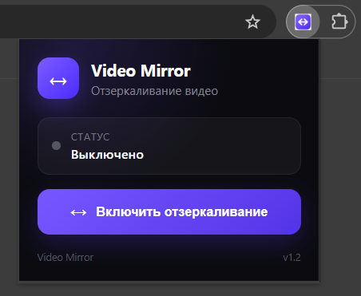

# 🎥 Video Mirror

> A simple and elegant browser extension for horizontal video mirroring.

Video Mirror allows you to mirror videos horizontally with a single click or keyboard shortcut.

Perfect for watching videos when you need a mirrored image — without changing the original video or downloading anything.


## ✨ Features

- 🔄 Horizontal video mirroring
- 🎬 YouTube support
- 📺 VK Video support
- ⚡ `Alt + M` keyboard shortcut
- 💾 Mirror state persistence
- 🎨 Premium dark popup interface
- 🧩 Manifest V3
- 🌐 Works with Chromium-based browsers
- 🚀 No external dependencies

## 📸 Screenshots

<p align="center">
  
</p>

## 📦 Installation

### Option 1. Install from Opera Addons

- https://addons.opera.com/ru/extensions/details/video-mirror/

### Option 2. Install from source

1. Download or clone this repository.
2. Open your browser's extensions page.
3. Enable **Developer mode**.
4. Click **Load unpacked**.
5. Select the `Video-Mirror` project folder.

The extension should appear in your browser's extensions list.

## 🎮 Usage

Open a webpage containing a video.

Click the **Video Mirror** extension icon and press:

**🔄 Enable Mirroring**

The video will immediately be mirrored horizontally.

### ⌨️ Keyboard shortcut

You can also toggle mirroring without opening the extension popup:

`Alt + M`
> ⌨️ The `Alt + M` keyboard shortcut may need to be manually assigned in your browser's keyboard shortcut settings.

## 🛠️ Project structure

```text
video-mirror/
│
├── manifest.json
├── background.js
├── content.js
│
├── popup.html
├── popup.js
├── popup.css
│
├── icon.svg
├── icon16.png
├── icon32.png
├── icon48.png
└── icon128.png
```

## 🔧 Development

### The extension uses:

- JavaScript
- HTML
- CSS
- Chrome Extensions Manifest V3

No external dependencies are required.

## 📄 License

MIT License

---

# 🇷🇺 Русская версия

# 🎥 Video Mirror

Video Mirror — простое и красивое расширение для браузера, которое позволяет зеркально отражать видео по горизонтали.

Зеркалирование включается одним нажатием или с помощью горячей клавиши.

Расширение не изменяет исходный видеофайл и не требует его скачивания.

## ✨ Возможности

- 🔄 Горизонтальное зеркалирование видео
- 🎬 Поддержка YouTube
- 📺 Поддержка VK Видео
- ⚡ Горячая клавиша `Alt + M`
- 💾 Сохранение состояния зеркалирования
- 🎨 Премиальный тёмный интерфейс
- 🧩 Manifest V3
- 🌐 Поддержка браузеров на Chromium
- 🚀 Не требует внешних зависимостей

## 📸 Снимки экрана

<p align="center">
  
</p>

## 📦 Установка

### Вариант 1. Установка из Opera Addons

- https://addons.opera.com/ru/extensions/details/video-mirror/

### Вариант 2. Установка из исходного кода

1. Скачайте или клонируйте этот репозиторий.
2. Откройте страницу расширений вашего браузера.
3. Включите «Режим разработчика».
4. Нажмите «Загрузить распакованное расширение».
5. Выберите папку проекта.

После этого расширение появится в списке установленных расширений.

### Поддерживаемые браузеры

- Google Chrome
- Яндекс Браузер
- Microsoft Edge
- Другие Chromium-based браузеры 

## 🎮 Использование

Откройте страницу с видео.

Нажмите на иконку расширения Video Mirror и выберите:

🔄 Включить отзеркаливание

Видео будет сразу отражено по горизонтали.

⌨️ Горячая клавиша

Для быстрого переключения можно использовать:

`Alt + M`
> ⌨️ Горячая клавиша `Alt + M` может потребовать ручного назначения в настройках сочетаний клавиш браузера.

## 🛠️ Структура проекта

```text
video-mirror/
│
├── manifest.json
├── background.js
├── content.js
│
├── popup.html
├── popup.js
├── popup.css
│
├── icon.svg
├── icon16.png
├── icon32.png
├── icon48.png
└── icon128.png
```

## 🔧 Технологии

### Проект использует:

- JavaScript
- HTML
- CSS
- Chrome Extensions Manifest V3

Внешние библиотеки и зависимости не используются.

## 📄 Лицензия

MIT License
